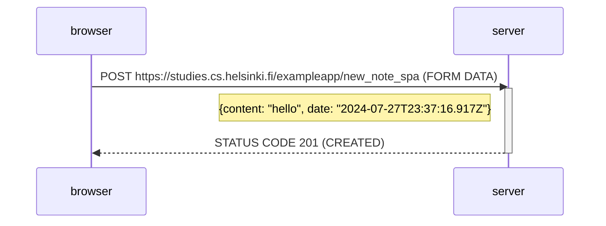

```mermaid
sequenceDiagram
    participant browser
    participant server

    browser->>server: POST https://studies.cs.helsinki.fi/exampleapp/new_note_spa (FORM DATA)
    activate server

 Note left of server:  {content: "hello", date: "2024-07-27T23:37:16.917Z"}
    
    server-->>browser: STATUS CODE 201 (CREATED)
    deactivate server
```
